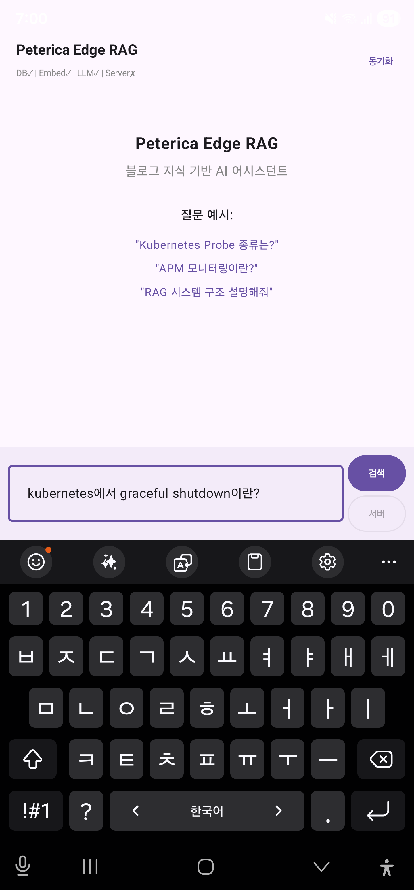
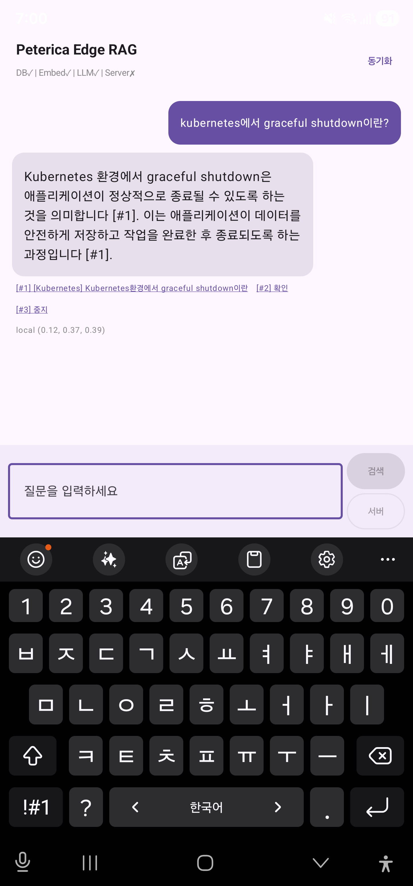
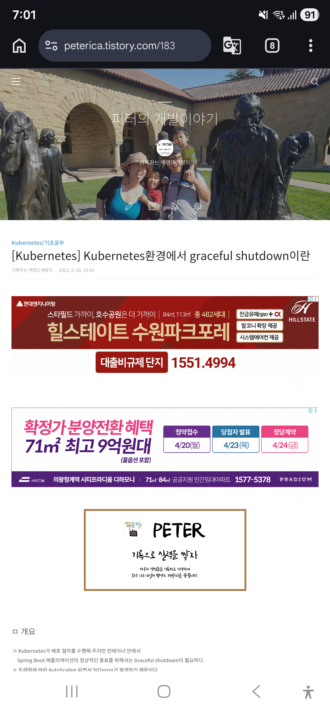

# Peterica Edge RAG

> 블로그 지식을 담은 **온디바이스 RAG** — 서버 없이, 네트워크 없이, 폰 안에서.

Mac Mini(FastAPI + Ollama) + Galaxy S23 Ultra(LiteRT-LM + sqlite) 하이브리드 시스템.
[피터의 개발이야기](https://peterica.tistory.com) 블로그 1,000여 편을 근거로 답하는 한국어 AI 어시스턴트입니다.

| 1. 질문 입력 | 2. 근거 인용 답변 | 3. 인용 원문 |
|---|---|---|
|  |  |  |
| 앱 상태: DB✓ / Embed✓ / LLM✓ / Server✗ (오프라인) | 답변 문장마다 `[#n]` 근거 청크. `local (0.12, 0.37, 0.39)` = Top-3 cosine distance | 인용 `[#1]`을 누르면 실제 블로그 글(peterica.tistory.com/183)로 이동 |

비행기 모드의 폰에서 "쿠버네티스에서 graceful shutdown이란?"을 묻자, 40초 뒤 블로그 183번 글의 청크를 인용하며 두 문장으로 답합니다.

---

## 특징

- 🔋 **서버 없이도 동작** — 블로그 지식·임베딩·LLM 전부 폰 안에 탑재
- 🧠 **Gemma 4 E2B** (2B 파라미터) on **LiteRT-LM** + Hexagon NPU
- 🇰🇷 **한국어 특화 임베딩** — `dragonkue/multilingual-e5-small-ko-v2` INT8 (113MB, 384차원)
- 📌 **인용 우선 RAG** — 모든 답변 문장에 `[#n]` 근거 청크 번호 부착
- 🔄 **하이브리드 모드** — 서버/폰 검색·생성을 UI 토글로 전환 가능
- 📊 **벤치마크 기반 결정** — 22 평가 쿼리로 임베딩·청크·프롬프트 선택

## 주요 수치

| 항목 | 값 |
|---|---|
| 임베딩 모델 (3자 벤치마크 우승) | e5-small-ko-v2 384d — MRR **0.947**, R@3 **1.000** |
| 청크 품질 개선 (MOC/entity 약한 청크 제거) | MRR **0.794 → 0.947**, 청크 수 118 → 93 |
| 모델 경량화 (ONNX INT8 동적 양자화) | 448MB → **113MB**, cosine 0.97~0.98 유지 |
| 폰 검색 속도 (93청크 × 384차원 brute-force cosine) | **< 1ms** |
| 폰 LLM 응답 시간 | **~40초** (Gemma 4 E2B on Hexagon NPU) |

## 아키텍처

```
┌─────────────────────────────┐         ┌─────────────────────────────┐
│  Mac Mini · FastAPI         │         │  Galaxy S23 Ultra           │
│  ─────────────────────────  │         │  ─────────────────────────  │
│  /query   RAG 종합 응답     │         │  sqlite + float32 BLOB       │
│  /search  Top-K 청크        │         │     → brute-force cosine     │
│  /sync    청크 DB 증분 배포 │  ETag   │  ONNX Embedding INT8 (113MB) │
│  Ollama   bge-m3 / gemma4   │ ──────▶ │  ONNX Tokenizer (5MB, 동봉) │
└─────────────────────────────┘         │  LiteRT-LM · Gemma 4 E2B     │
                                        └─────────────────────────────┘
          임베딩 모델 통일 → dragonkue/multilingual-e5-small-ko-v2 (384d)
          청크 저장소    → sqlite 단일 파일 (MOC/entity 필터 후 93 청크)
```

서버·폰이 **같은 임베딩 모델**을 쓰기 때문에 사용자 쿼리를 한 번만 임베딩하고, DB도 한 벌만 유지합니다.

## 기술 스택

| 레이어 | 기술 | 선택 이유 |
|---|---|---|
| LLM (폰) | Gemma 4 E2B · LiteRT-LM | Hexagon NPU 가속, 2B로 40초/응답 |
| 임베딩 | `multilingual-e5-small-ko-v2` INT8 (384d) | 한국어 22쿼리 MRR 0.947, 서버·폰 공유 |
| 벡터 검색 (폰) | sqlite + brute-force cosine | 93청크 규모, sqlite-vec arm64 미지원 회피 |
| 토크나이저 (폰) | `onnxruntime-extensions` (ONNX 그래프 내장) | DJL Android arm64 native 부재 우회 |
| 서버 | FastAPI · sqlite-vec · Ollama | Python AI 생태계 접근, 로컬 추론 |
| 동기화 | `/sync` ETag (`wiki_commit` + `chunker_version`) | 증분 다운로드, 304 캐시 |

## 빠른 시작

### 0. 블로그 위키 준비

이 레포는 블로그 원문을 포함하지 않습니다. 동일한 부모 디렉토리에 [peterica-blog-wiki](https://github.com/peterica) 형식의 마크다운 위키를 두는 것이 기본 가정입니다 (경로는 `server/.env.example`에서 조정 가능).

```bash
# 예: 같은 부모 디렉토리에 위키 레포 클론
git clone <your-wiki-repo> peterica-blog-wiki
```

### 1. 서버 (Mac Mini / macOS · Linux)

```bash
cd server
python -m venv .venv && source .venv/bin/activate
pip install -r requirements.txt

cp .env.example .env           # 필요 시 WIKI_DIR · SERVER_API_KEY 등 조정
python ingest.py               # 마크다운 청킹 + 임베딩 인제스트
python main.py                 # FastAPI 기동 — 0.0.0.0:8600
```

서버가 띄워진 상태에서 폰 앱을 실행하면 `/sync` 엔드포인트로 청크 DB를 내려받고, 이후로는 오프라인에서도 동작합니다.

### 2. 모바일 (Android · arm64)

```bash
cd mobile
./scripts/device.sh            # adb 기기 연결 확인
./scripts/run.sh --clean       # 빌드 + 설치 + 실행 + logcat
```

LLM(Gemma 4 E2B, ~2.4GB)과 임베딩 ONNX(113MB)는 용량 문제로 git 추적에서 제외됩니다.
수동 다운로드·배치 절차는 [`docs/002-Hybrid-AI-System.md`](docs/002-Hybrid-AI-System.md)를 참고하세요.

## 디렉토리 구조

```
peterica-edge-rag/
├── server/                 # FastAPI + Ollama RAG 서버
│   ├── main.py             #   /query, /search, /sync, /health
│   ├── ingest.py           #   마크다운 → 청크 → 임베딩 → sqlite
│   ├── embed.py            #   Ollama 임베딩 어댑터
│   ├── embed_st.py         #   sentence-transformers 어댑터
│   ├── rag.py              #   검색 + 시스템 프롬프트 조립
│   ├── db.py               #   sqlite-vec DB
│   └── scripts/            #   양자화·평가·A/B·토크나이저 ONNX 변환
├── mobile/                 # Android 앱 (Kotlin + Jetpack Compose)
│   ├── app/src/main/
│   │   ├── java/com/peterica/edgerag/
│   │   │   ├── data/       #   EmbeddingEngine, VectorSearch, LlmEngine, ServerApi
│   │   │   ├── db/         #   ChunkDatabase
│   │   │   └── ui/         #   ChatScreen, ChatViewModel
│   │   └── assets/         #   model.onnx · tokenizer.onnx (로컬 배치, git 제외)
│   └── scripts/            #   build · install · run · logcat · serve-apk
└── docs/
    ├── 001-project-research.md
    ├── 002-Hybrid-AI-System.md   # 정의서 (v3)
    └── assets/                    # README 스크린샷
```

## 학습 목적

이 프로젝트는 **기능보다 학습**을 우선합니다. 시스템이 사용자 제품이 되기보다는, 한 엔지니어가 다음 네 가지를 **손으로 깎아보는** 데 목적이 있습니다.

- LLM 비결정성을 **프롬프트·파이프라인 구조**로 통제하기
- RAG를 **운영 가능한 구조**로 설계하기 (인용·품질 지표·동기화·롤백)
- 엣지 AI 리소스 제약(메모리·토크나이저·NPU) 하에서의 **트레이드오프** 읽기
- 22개 쿼리 평가 하네스로 **감이 아닌 지표로 결정**하기

시행착오의 전말은 블로그 시리즈에 기록되어 있습니다:

- [1064 — 맥미니 RAG 구축기](https://peterica.tistory.com/1064)
- [1066 — 맥미니 RAG를 넘어서, 모바일 온디바이스 AI](https://peterica.tistory.com/1066)
- [1067 — 3트랙 병렬 리서치: 쓰기 전에 물어봐야 할 것들](https://peterica.tistory.com/1067)
- [1068 — 엣지 RAG의 AI 도구 지도: 왜 Python이 접합점인가](https://peterica.tistory.com/1068)
- [1069 — 448MB가 113MB 되는 길: ONNX INT8 양자화 실전](https://peterica.tistory.com/1069)
- **[1071 — 내 폰이 내 블로그에 답하게 만들었다: 온디바이스 RAG 다섯 가지 기술](https://peterica.tistory.com/1071)** ← 이 레포의 본편

## 라이선스

(프로젝트 라이선스는 레포 설정에 따릅니다.)
